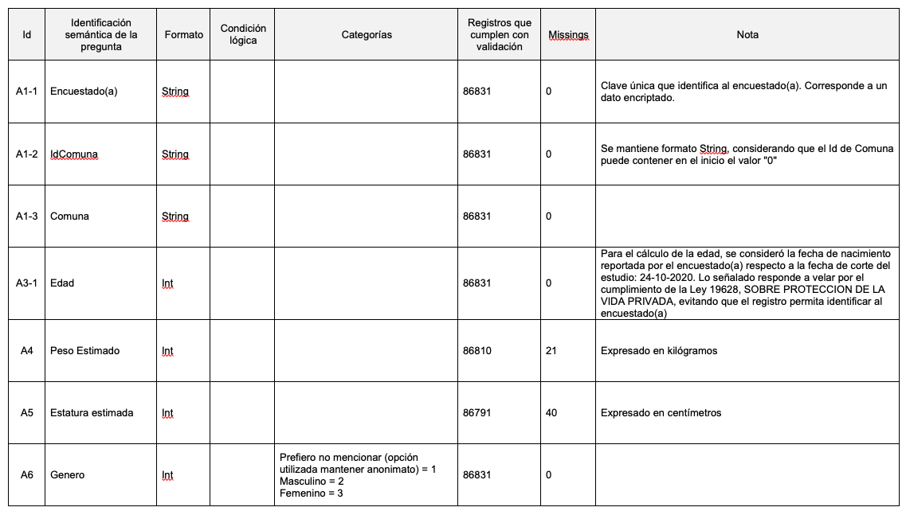
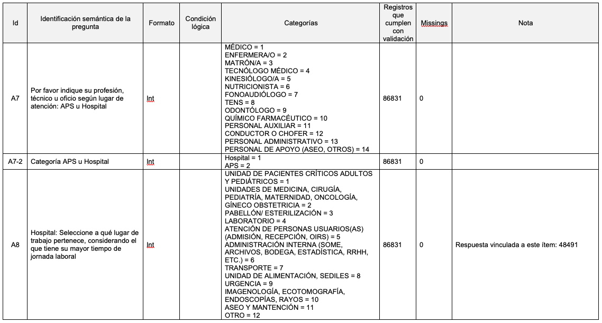
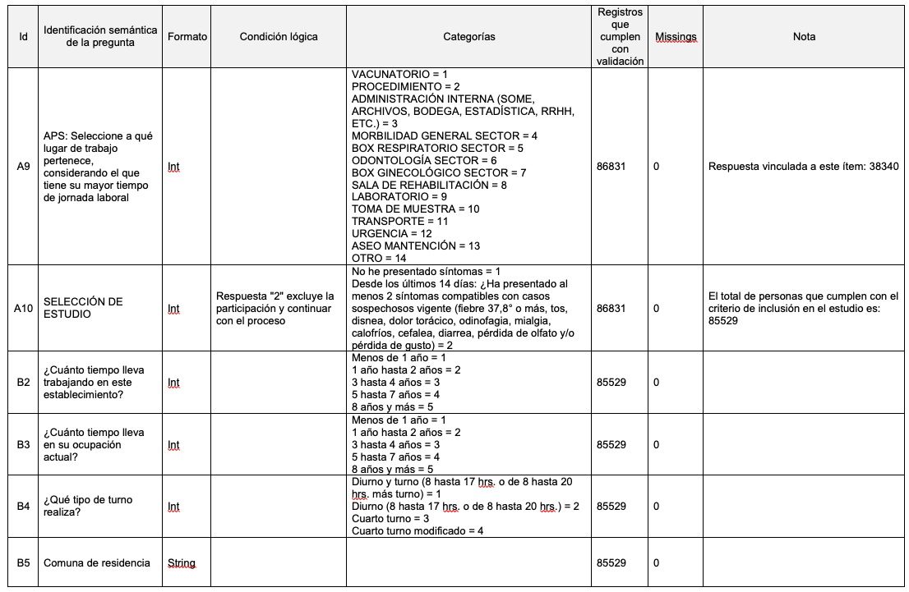
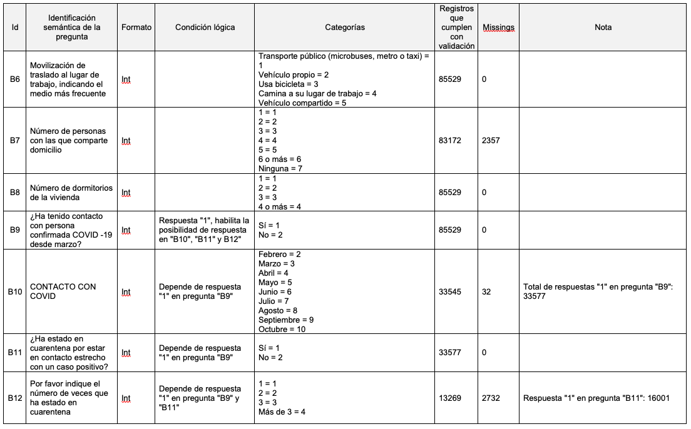
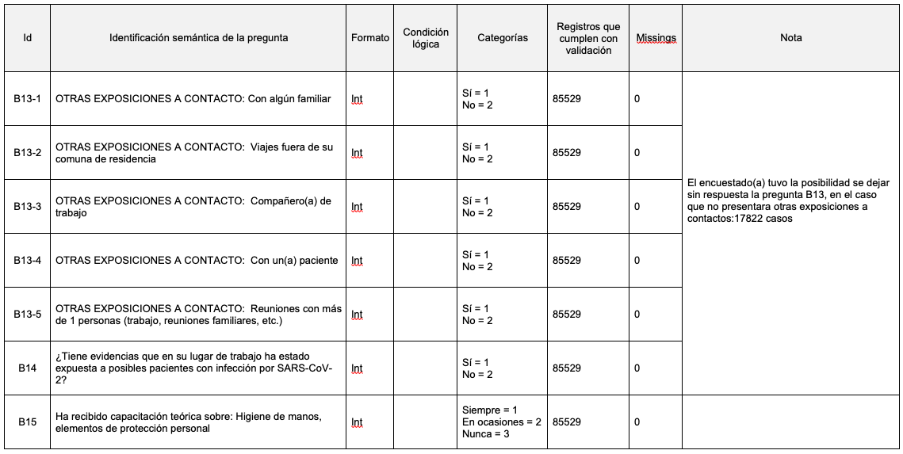
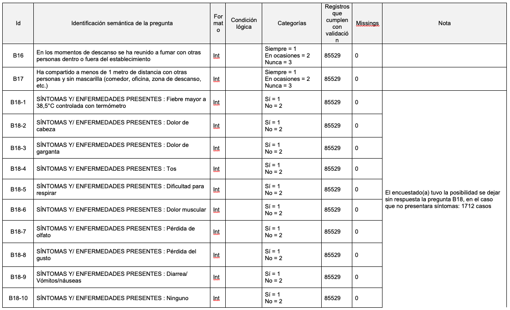
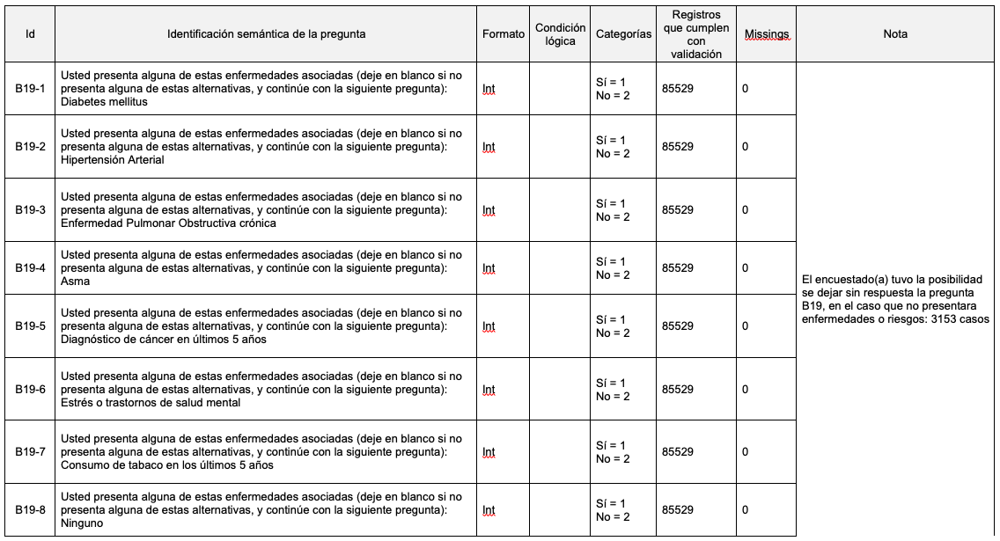
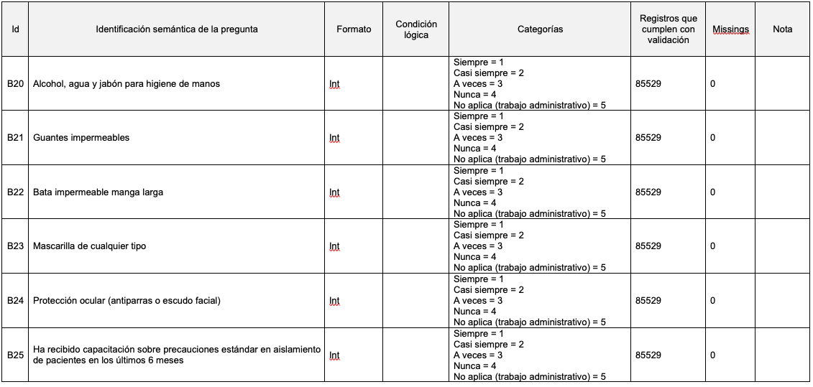
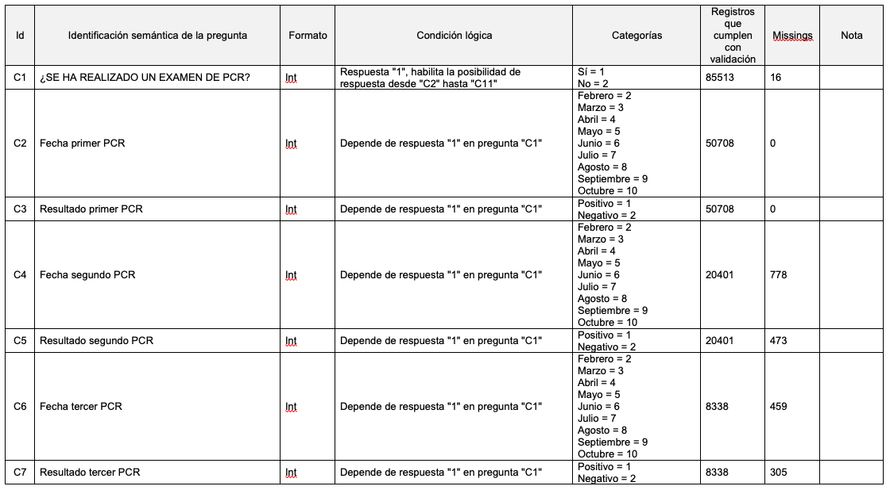
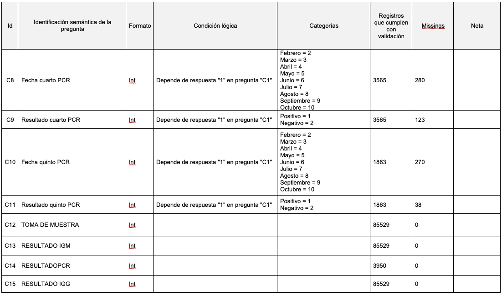

 

## Documento de soporte para el procesamiento de la base de datos vinculada al levantamiento de la prevalencia de anticuerpos SARS-CoV-2 en trabajadores del sector salud, durante la primera ola de COVID-19 en Chile

**Ministerio de Ciencia, Tecnología, Conocimiento e Innovación**

**Ministerio de Salud**

Documento generado en: 23 de febrero, 2021

**https://www.minciencia.gob.cl/**

**https://www.minsal.cl/**

**Información de documento**

**Número ID: CHL-MC-MS-2021-V1**

**Información vinculada a la base de datos pública**

**Tipo de dato:** Encuesta por muestreo.

**Unidad de análisis:** Trabajadores de salud del sector público de salud.

**Total de registros en la fuente:** 86.831. De éstos, 85.529 cumplen con el criterio de inclusión para el estudio, al dar negativo en la pregunta por sintomatología presente en el período estimado para participar en el estudio.

**Nota:** Se mantienen los datos que velan por el cumplimiento de la Ley 19628, SOBRE PROTECCION DE LA VIDA PRIVADA. De esa forma, se han omitido los datos de carácter personal o datos personales, relativos a cualquier información concerniente a personas naturales, identificadas o identificables, como también se ha efectuado un procedimiento de disociación de datos, de manera que la información que se obtiene no pueda asociarse a persona determinada o determinable. Finalmente, los registros omiten las señas que puedan permitir la identificación de las personas consultadas. Teniendo eso en consideración, la fuente omite todos los campos que podrían impedir con el cumplimiento de lo señalado por la Ley 19628.

En coherencia con la revisión del equipo jurídico del Ministerio de Salud, tanto el documento como la tabla, cumplen con los estándares de protección de datos vigentes.

**Información general del proceso de levantamiento de datos**

El levantamiento de datos se enmarca en el proceso de investigación: &quot;Prevalencia de anticuerpos SARS-CoV-2 en trabajadores del sector salud, durante la primera ola de COVID-19 en Chile&quot;.

El estudio fue diseñado en agosto de 2020 por personal del Ministerio de Salud (MINSAL) en conjunto con un consejo asesor académico. Se contó con la participación de 28 de los 29 Servicios de Salud que conforman el Sistema Nacional de Servicios de Salud de Chile. El Servicio de Salud Araucanía Sur no participó en el proceso por factores administrativos. De manera complementaria se contó con la participación de la Central de Abastecimiento (CENABAST), datos que fueron incluidos, con un criterio administrativo territorial, en la comuna de Ñuñoa.

El proceso toma relevancia al considerar que el sector público de salud abarca más del 40% de la fuerza laboral de salud en el país, con una cobertura de usuarios(as) de más del 70% de la población nacional.

Es así, que la población de trabajadores de salud (TS) que participó en el estudio (86.831 registros validados), incluye a personas nivel de Atención Primaria de Salud (APS) y el nivel Hospitalario, como también de Direcciones de Servicios de Salud y CENABAST, cubriendo distintas funciones laborales: clínicas, administrativas y de apoyo. De esa forma se alcanzó una participación del 33% de TS del sector público de salud.

En cuanto a la metodología de soporte para el proceso, se aseguró un estándar de la implementación por medio actividades de apoyo técnico asistenciales. Estas actividades se realizaron antes y durante la ejecución del estudio, cubriendo aspectos propios de la encuesta y de la toma de muestra de sangre.

Específicamente para la recolección de datos y registros en la base de datos, se contó con el desarrollo de una aplicación web por parte del equipo de TIC MINSAL. El aplicativo fue consistente con la encuesta epidemiológica diseñada por el equipo investigador. Además, éste fue alojado en el servidor de MINSAL, cumpliendo con las normas de seguridad vigentes. Esto toma relevancia al tener en consideración que los datos almacenados son sensibles.

Para el proceso de validación de datos que contiene la fuente, se efectuaron 2 tareas de validación: una por parte de los encuestadores(as) y otra a cargo del equipo del nivel central de MINSAL, en base a criterios de consistencia. De esa forma el archivo que permite el procesamiento y análisis vinculado a los datos del proceso de investigación cumple con un estándar de calidad.

En coherencia con lo señalado anteriormente, el trabajo fue orientado para cumplir con el objetivo de determinar la prevalencia de anticuerpos y los factores de riesgo asociados con la seropositividad en la comunidad de trabajadores de la salud de Chile. Siendo el resultado del proceso implementado, el principal insumo de este documento.

**Métodos de recolección de datos**

La recolección de datos se realizó por medio de una encuesta construida en aplicativo alojado en el servidor de MINSAL. Enlace:

[https://estudiofuncionariosdesalud.minsal.cl/login.jsp](https://estudiofuncionariosdesalud.minsal.cl/login.jsp)

El aplicativo fue diseñado para contar con perfiles de usuarios (encuestador(as)), a quienes se le asignaron los atributos de incorporar y modificar datos, previa identificación con credenciales individuales (usuario y contraseña). Cada usuario tuvo un acceso restringido solo a los datos de encuestados(as) que registró. Como también, al terminar cada aplicación del cuestionario (incluyendo el registro de la prueba de anticuerpos COVID-19), se entregó la opción de modificar el estado del encuestado(a) a &quot;Cerrado&quot;. De esa forma se aseguró la privacidad en la administración de datos, como también de la conformidad en la carga de datos por parte del encuestador(a).

En el caso del perfil administrador, se asignó el atributo de crear usuarios(encuestador(a)) y de crear establecimientos o dispositivos de la red asistencial (conforme con la última base de datos vigente de establecimientos de DEIS, MINSAL).

Cada solicitud de creación de usuarios para la aplicación, fue recibida en un formato estándar. Los archivos fueron recepcionados por el equipo de MINSAL, con el respaldo de informar al profesional que representó al equipo investigador en el territorio (funcionario(a) de la Dirección de Servicio de Salud).

Respecto al acceso a los datos registrados en la base de datos, fue restringido durante todo el proceso, y solo se dio un acceso para consulta por parte de profesionales del MINSAL. Los profesionales del MINSAL no contaron con atributos para modificar o eliminar datos vinculados con encuestados(as).

Es importante señalar que el aplicativo pasó por una etapa de pilotaje, iniciada el día 2 de septiembre de 2020 y se extendió por casi 2 semanas. El objetivo de esta etapa fue poner a prueba la calidad de la aplicación y su nivel de seguridad. Esta etapa del proceso consideró exclusivamente a establecimientos dependientes de los Servicios de Salud, utilizando la conexión de la red MINSAL.

Al cumplir la etapa de pilotaje, que fue acompañada de la revisión y validación del Departamento de Tecnología Informática (TIC) MINSAL, fue posible dar acceso a unidades externas a las dependencias de Servicios de Salud, es decir, a los centros de salud y dispositivos de dependencia Municipal.

Con fecha 11 de septiembre, fue posible incluir de manera progresiva, una mayor cantidad de registros de encuestadores(as) a lo largo de todo el país, el cual culminó con el cierre de toma de muestras el día 24 de octubre del año 2020.

**Métodos de validación de datos**

La validación de datos se conformó de 2 etapas. La primera efectuada por parte de los encuestadores(as) hasta el día 26 de noviembre del año 2020. La segunda fue realizada por el equipo responsable del estudio en el MINSAL, durante enero del año 2021.

En cuanto a la validación realizada por los encuestadores(as), ésta consistió en la revisión de los datos registrados vinculados a cada encuestado(a) en el estudio. En total la fuente recolectó 88.926 registros.

Cada registro contó con una categoría descriptiva del estado del registro:

- &quot;Completa (Cerrada)&quot;: Cumple con todos los ítems obligatorios con respuesta y es un registro validado y cerrado por el encuestador(a). 87.628 registros (98,5%).

- &quot;Completa (Sin cerrar)&quot;: Cumple con todos los ítems obligatorios con respuesta, pero sin un cierre del formulario por parte del encuestador(a).342 registros (0,4%).
- &quot;Incompleta&quot;: No cumple con todos los campos obligatorios con respuestas.929 registros (1,0%)
- &quot;Sin categoría&quot;: Corresponde a 27 registros (0,0%) en los cuales la aplicación web no asignó una categoría ya que no cumplió con las reglas de negocio definidas en el sistema, como también se debe considerar que se realizaron registros de prueba para acompañar a los equipos en la adecuada utilización de la aplicación web, motivo por el cual, en la etapa de validación de la fuente, son registros en estado &quot;Sin categoría&quot; quedaron excluidos.

En el caso de la validación que implementó el equipo de MINSAL, se diseñó una metodología orientada al objetivo de asegurar la consistencia de los registros en la base de datos. Para lograr lo señalado se establecieron 2 controles de calidad:

1. **Control de calidad de datos personales de personas encuestadas** : Este control de calidad se orientó en la consistencia de datos a nivel personal del encuestado(a). Además, se diseñaron 2 grupos de criterios, que en una aplicación progresiva, dieron una consistencia al objetivo del control de calidad.

  1. **Criterios de hallazgos de registro:** Identifica casos que impiden asegurar una calidad total del registro. Se debe considerar que el criterio 1 fue aplicado a todos los registros en la fuente (88.926 registros). Mientras que desde el criterio 2 hasta el criterio 7, solo aplica para los registros con un Estado &quot;Completa&quot; (&quot;Cerrada&quot; o &quot;Sin cerrar&quot;) (87.970 registros).

- **Criterio de hallazgo de registro - 1: Estado distinto a Encuesta &quot;Completa&quot; (cerrada o sin cerrar):** 956 casos con hallazgos.
- **Criterio de hallazgo de registro - 2: Dígito de verificación inconsistente con número de RUT:** 4 casos con hallazgos.
- **Criterio de hallazgo de registro - 3: Rut duplicado según estado de encuesta &quot;Completa&quot; (cerrada o sin cerrar):** 1.149 casos con hallazgos.
- **Criterio de hallazgo de registro - 4: Edad inferior a 18 años o inconsistencia de registro en fecha de nacimiento:** 238 casos con hallazgos.
- **Criterio de hallazgo de registro - 5: Rut con 2 o más fechas de nacimiento según estado de encuesta:** 120 casos con hallazgos.
- **Criterio de hallazgo de registro - 6: Sin identificación de lugar de trabajo APS u Hospital:** 221 casos con hallazgos.
- **Criterio de hallazgo de registro - 7: Sin respuesta en ítem de criterio de inclusión para el estudio:** Sin casos con hallazgos.

  1. **Criterios de exclusión:** Identifica registros que no cumplen con un estándar para ser considerados en la etapa de procesamiento. Es decir, el grupo de criterios de exclusión dan soporte a la máxima rigurosidad del control de calidad para el proceso. Esto se fundamenta en la primicia que existen criterios de hallazgos de registros que no son excluyentes por sí mismos, pero si en combinaciones con otros.De esa forma, todo registro que dio positivo en uno o más de los criterios de exclusión, no fue considerado en la etapa de procesamiento de datos y análisis. Resultando un total de 2.095 casos excluidos, teniendo en cuenta que algunos registros incumplieron en 2 o más criterios de exclusión. Los criterios de exclusión utilizados son:

- **Criterio de exclusión - 1: Incumplimiento de criterios de hallazgo de registros 1 o 2 o 4 o 6 o 7:** 1.417 casos con hallazgos.
- **Criterio de exclusión - 2: Incumplimiento de criterios 3 y 5:** 128 casos con hallazgos.
- **Criterio excluyente 3: Rut duplicado y no corresponde a la última actualización en base de datos:** 558 casos con hallazgos.

Al finalizar el &quot;Control de calidad de datos personales de personas encuestadas&quot;, se consiguen **86.831 registros (97,6% del total de 88.926 casos), que cumplen con la calidad suficiente para pasar a la siguiente etapa de validación.**

1. **Control de calidad de respuestas registradas:** Este control de calidad estuvo conformado por 45 criterios de hallazgos de registro exclusivamente vinculadas a las respuestas. Es importante señalar que este procesamiento se centra básicamente en los registros que cumplieron con el criterio de inclusión para el estudio, correspondiente a la respuesta &quot;B. No he presentado síntomas&quot; de la pregunta &quot;SELECCIÓN DE ESTUDIO:&quot;. En total son 85.529 registros (98,5% del total) que cumplieron con el criterio para pasar a este control de calidad, representando al grupo de personas que participarían en el análisis de datos.

El control de calidad de respuestas registradas permitió identificar hallazgos de origen informático y de usuario, considerando según el tipo de pregunta la consistencia en:

- Consistencia del dato respecto al rango de respuesta definido.
- Consistencia del tipo de dato esperado para la respuesta (string, int, etc.).
- Consistencia del tipo de respuesta en cuanto a longitud y contenido, en el caso de respuestas con categorías predefinidas.
- Consistencia de dependencia de respuesta respecto a pregunta previa condicionante (coherencia en las condiciones lógicas de diseño del instrumento).

El detalle de los resultados, según el elemento del cuestionario, será presentado en la sección correspondiente.

La siguiente tabla resume el período de recolección 1 de datos hasta la validación de éstos:

| Inicio | Fin | Etapa |
| --- | --- | --- |
| 02-09-2020 | 11-09-2020 | Piloto de aplicación web (cuestionario) |
| 11-09-2020 | 24-10-2020 | Registro de encuestadores(as) |
| 24-10-2020 | 26-11-2020 | Validación de datos registrados por parte de encuestadores(as) |
| 18-01-2021 | 27-01-2021 | Validación de datos registrados por parte del equipo MINSAL |

**Cuestionario y variables**

A continuación, se presentarán las variables en la base de datos, las cuales representan al cuestionario implementado durante la investigación. Como se mencionó anteriormente, cumplen con los criterios de ser incluidas para velar por el cumplimiento de la Ley 19628, SOBRE PROTECCION DE LA VIDA PRIVADA. De esa forma, el ID de la pregunta no siempre seguirá una codificación correlativa, considerando que existen variables que fueron omitidas respecto a la base de datos original.

Por otra parte, se incluirá la cantidad de registros aprobados, en cuanto a su calidad, por cada pregunta. Como también se indicará el número de missings cuando corresponda. Finalmente, con el fin de dar soporte a procesamientos independientes de la fuente, se incluyeron los códigos de preguntas, de categorías, las condiciones lógicas que generan dependencias, como también notas de utilidad para la pregunta.

